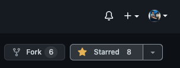
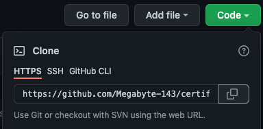
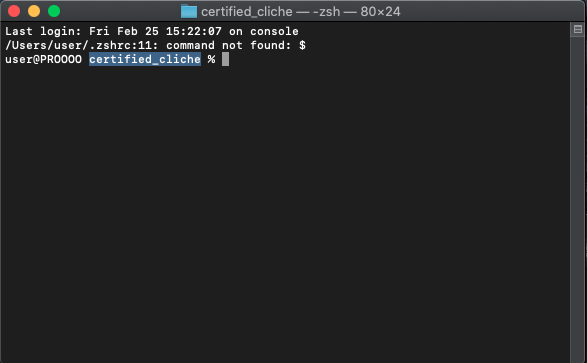
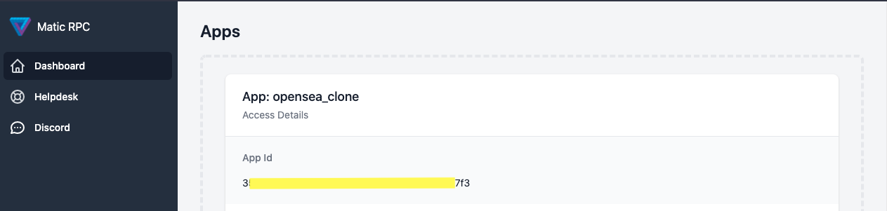
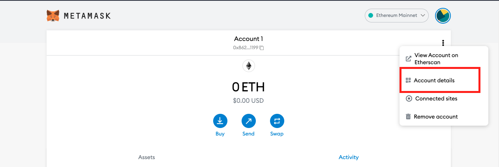
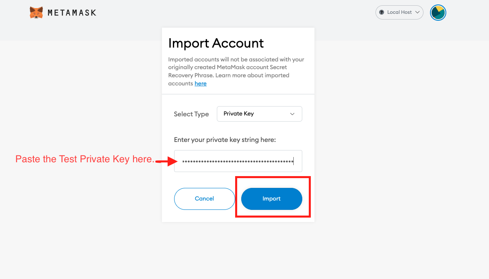
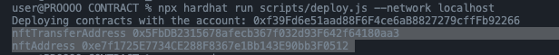

# <a href="https://certified-cliche.vercel.app/">Certified-Cliché</a>

## `Uniqueness with Authenticity.`

<a href="https://www.youtube.com/watch?v=rJpA7ulK2rQ" target="_blank" >
 
</a>

## Problem Description

Today the authenticity of online certificates has fallen due to practices like forging, editing, etc. therefore they have lost their uniqueness.

We all have done some courses or worked in companies etc, and we get the certificates for the same, this is one of the rewards we get from the hard work. But how would you feel if someone get all those certificates without doing hard work and only by editing them? And to prevent this from happening anymore we built
`Certified Cliché`.

## Solution

Certified-Cliché, is a platform that will get the authenticity of the CERTIFICATES to the highest level.

The idea is to provide a platform where the Institutions, Organisations, or anyone who provides certificates will convert it into the NFT or store it in an NFT.
That will make their certificate authentic, and then they can transfer it to the applicant. On the other hand, applicants can check all of their certificates, or NFTs they received now, and then they may showcase them to the other platforms.

Our idea is unique in itself as it restores the uniqueness and authenticity of Certificates by storing them as or in as NFT and making them more valuable.

## ROADMAP

 - <a href = "https://www.figma.com/file/HjYi7KbugT0xsXoA7arIN2/Certified-Cliche?node-id=0%3A1" target="_blank" >Figma</a>
 - <a href="https://whimsical.com/workflow-JuAUDpown8n3EBjRqDShHQ" target="_blank">Workflow</a>
 - <a href = "https://whimsical.com/architecture-T6APUm5Y1Cii8SC4UnndDM" target="_blank">Architecture</a>

## Set Up

### Prerequisites

- <a href ="https://www.geeksforgeeks.org/how-to-install-and-use-metamask-on-google-chrome/" target="_blank">Metamask Installed as extension in your Browser<a/>
- <a href ="https://www.geeksforgeeks.org/installation-of-node-js-on-windows/" target="_blank"> Nodejs Installed in your system<a/>
- <a href ="https://www.geeksforgeeks.org/ultimate-guide-git-github/?ref=gcse" target="_blank">Knowledge of Git and GitHub<a/>
- <a href ="https://code.visualstudio.com/docs/setup/windows">Install VS CODE </a> or Any other IDE

## Intialization

### To Contribute give the repo a Star⭐️ and Fork it.
</img>

### Clone the repo.

```
git clone https://github.com/${GitHub Username}/certified_cliche.git
```

</img>

Example => `git clone https://github.com/Megabyte-143/certified_cliche.git`

### Open Terminal on the Folder

```
cd certified_cliche
```

</img>

### Checkout to the `dev` branch

```
git checkout dev
```

### Go the the `client` directory

```
cd client
```

### Install the Dependencies

for `npm`
```
npm install
npm install -D tailwindcss@latest postcss@latest autoprefixer@latest
```
or for `yarn`

```
yarn install install
yarn add --dev tailwindcss@latest postcss@latest autoprefixer@latest
```
### Switch to the `CONTRACT` directory

```
cd ..
cd CONTRACT
```

### Install the Dependencies

for `npm`
```
npm install
```
or for `yarn`
``` 
yarn install 
```
## 🔴 Important 🔴

- Create a file in `CONTRACT` directory named as `.projectId`

```
touch .projectId
```

- Paste the Project ID in it.

This is the example of <a href="https://rpc.maticvigil.com/">MATIC VIGIL</a>
</img>

```
echo {appId} > .projectId
```

- Get a Test Wallet

```
npx hardhat node
```

- Copy any Private Key.

</img>

- Open a New Terminal at `certified_cliche`

- Create a file in `CONTRACT` directory named as `.secret`

```
cd CONTRACT
touch .secret
```

- Paste the Test Wallet `Private Address` in it.

```
echo {privateKey} > .secret
```

- SetUp the Metamask Test Wallet [with same Private Address].

This is the example of TEST WALLET in METAMASK.
</img>
</img>

## Open The Folder in the VS Code or any IDE. 

### [To Run On LocalHost][recommended]

- Switch to CONTRACT Directory [if you are not on it already]

```
cd CONTRACT
```
- Run the Nodes

```
npx hardhat node
```
- Open a new Terminal on `CONTRACT` Directory

- Deploy the contract on the LocalHost

```
npx hardhat run scripts/deploy.js --network localhost
```
- Copy the `NFT CONTRACT ADDRESS` and the `NFT TRANSFER ADDRESS`, and paste them in the `CONTRACT/config.js`

</img>

- Open New Terminal on the `client` folder.

- Uncomment the LocalHost provider in `client/pages/home-backup.js`

```
 const provider = new ethers.providers.JsonRpcProvider();
```
- Copy the `NFT.json` file from

```
CONTRACT/artifacts/contracts/NFT.sol/NFT.json
```

- and replace it with the

```
client/abi/NFT.json
```
-  Copy the `NFTTransfer.json` file from

```
CONTRACT/artifacts/contracts/NFTTransfer.sol/NFTTransfer.json
```

- and replace it with the

```
client/abi/NFTTransfer.json
```

- Set the Metamask Network to LocalHost

- Run the UI

```
npm run dev
```

## And Now you may Start Contributing 😀


### [To Run On Polygon Mumbai Testnet]

- Get the Polygon Mumbai Testnet `RPC URL` from the providers.
-- For Example => Infura, MaticVigil

- Copy the `Project Id` from the RPC URL Provider and paste it in CONTRACT/hardhat.config.js

```
mumbai: {
      url: `https://rpc-mumbai.maticvigil.com/v1/${projectID}`,
      accounts: [prvKey]
    }
```
- Paste the RPC URL in the CONTRACT/config.js

```
export const rpc_url = `rpcUrl`;
```

- Get a wallet where you have Mumbai Testnet Tokens for deployment and other work around.

You can get them by using a demo wallet and requesting through `Polygon Faucet`.

- Paste the Wallet Private Key into the `CONTRACT/hardhat.config.js`

```
const prvKey = 'privateKey'
```
- Deploy the Contract on the Polygon Mumbai Testnet

```
npx hardhat run CONTRACT/scripts/deploy.js --mumbai
```
- Copy the `NFT CONTRACT ADDRESS` and the `NFT TRANSFER ADDRESS`, and paste them in the `CONTRACT/config.js`
- Open New Terminal on the `client` folder.
- Uncomment the Mumbai Testnet provider

```
For the Mumbai Testnet
const provider = new ethers.providers.JsonRpcProvider(rpc_url);
```
- Copy the `NFT.json` from

```
CONTRACT/artifacts/contracts/NFT.sol/NFT.json
```

- and replace it with the

```
client/abi/NFT.json
```
- Copy the `NFTTransfer.json` from

```
CONTRACT/artifacts/contracts/NFTTransfer.sol/NFTTransfer.json
```

- and replace it with the

```
client/abi/NFTTransfer.json
```

<a href="https://blog.pods.finance/guide-connecting-mumbai-testnet-to-your-metamask-87978071aca8">Add the RPC URL in your Metamask</a>

- Run the UI

```
npm run dev
```

## 🔴 Please Note 🔴

- Currently it is deployed on the Polygon Mumbai-Testnet.

- Make Pull Request on Dev Branch Only

<div align="center">
<h2>For Any Queries</h2>
<a href="https://t.me/+kJl1BmcgYfo2YzM1"> </a>
</div>

## 🌟 Contributors 

Thanks to these wonderful people ✨✨:

<table>
	<tr>
		<td>
			<a href="https://github.com/Megabyte-143/certified_cliche/graphs/contributors">
  				
			</a>
		</td>
	</tr>
</table>

<div align="center"> 
<h2>Project Created by </h2>

<h1 align="center">

<a href="https://www.linkedin.com/in/angshuman-barpujari-26504016b/">Angshuman Barpujari</a>

<a href="https://www.linkedin.com/in/yash-garg-megabyte/"> Yash Garg</a>

</h1>

</div>
